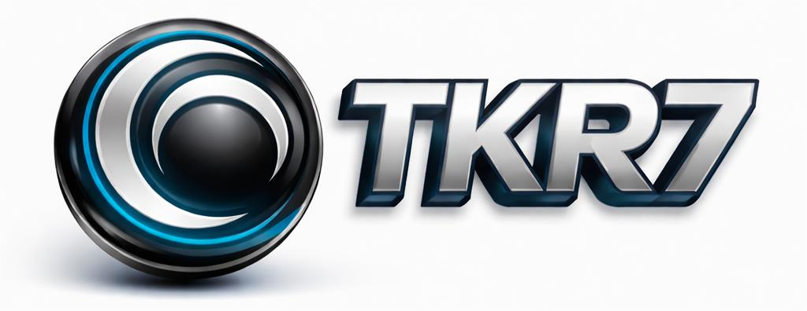

  

---

<h1 align="center">👋 Olá, eu sou Thomas Kirmeier</h1>
<h3 align="center">Desenvolvedor em formação | Web & Mobile | Flutter • Backend</h3>

---

---

  
  
  

---

## 🚀 Sobre mim

Sou desenvolvedor em formação com foco em aplicações **Web e Mobile**, atuando desde o design de interfaces até a implementação de funcionalidades e versionamento de código.

Tenho experiência prática com **Flutter, PHP e JavaScript**, utilizando **Figma** para prototipação e **Git/GitHub** para controle de versão e organização de projetos.

### 🎯 Atualmente busco:
- Aprimorar arquitetura e organização de projetos  
- Consolidar boas práticas de backend  
- Oportunidade de **estágio ou experiência profissional** na área  

---

## 🛠️ Tecnologias & Ferramentas

### **Mobile**
Flutter • Dart

### **Web / Backend**
HTML • CSS • JavaScript • PHP

### **Ferramentas**
Git • GitHub • Figma • VS Code

---

## 🔥 Projetos em Destaque

### 📱 **Recicla+**
Aplicativo mobile desenvolvido em **Flutter**, com foco em conectar coletores e usuários para facilitar o processo de reciclagem.

**Principais funcionalidades:**
- Login e cadastro de usuários  
- Denúncia e solicitação de coleta  
- Interface moderna prototipada no Figma  

🔗 Repositório:  
https://github.com/Tkr7-Alice/recicla_mais

---

### 🌐 **Projeto PI — SUPA**
Projeto acadêmico com proposta diferenciada, focado em estruturação de sistema, organização de código e aplicação de conceitos estudados durante o curso.

🔗 Repositório:  
https://github.com/Tkr7-Alice/Projeto_PI_supa

---

### 🖥️ **InfoNOW — Painel Web**
Painel informativo consumindo múltiplas APIs, com foco em organização visual e experiência do usuário.

**Funcionalidades:**
- Clima, filmes, países e dados dinâmicos  
- Tema escuro/claro  
- Estrutura web separada (HTML, CSS e JavaScript)

---

## 📊 Estatísticas do GitHub

  

  

---

## 🐍 Atividade no GitHub

  

---

## 📬 Contato

  

---

<h3 align="center">✨ Obrigado por visitar meu perfil. Fique à vontade para explorar meus projetos!</h3>
