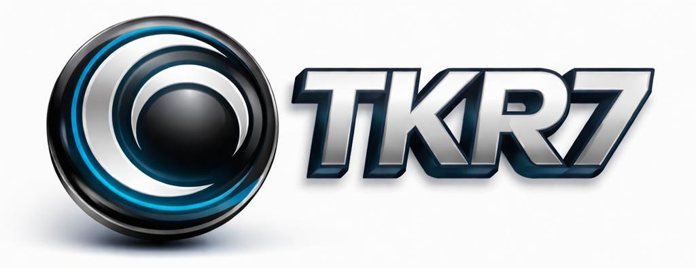

---

<h1 align="center">👋 Thomas Kirmeier</h1>
<h3 align="center">
Desenvolvedor Web & Mobile | Python • Flutter • Backend
</h3>

Construindo sistemas simples, funcionais e bem estruturados.

---

## 🚀 Sobre mim

Sou desenvolvedor com foco em **aplicações Web e Mobile**, atuando desde a **concepção visual (UI/UX)** até a **implementação funcional e organização do código**.

Tenho experiência prática com **Flutter** e desenvolvimento web, e atualmente estou **aprofundando meus estudos em Python**, linguagem que escolhi como base para meus próximos projetos, especialmente em **backend, automações e APIs**.

Busco evolução constante em **arquitetura de software**, **boas práticas**, **organização de projetos** e **qualidade de código**, sempre aplicando na prática o que estudo.

### 🎯 Atualmente focado em:
- Python aplicado a projetos reais  
- Estruturação de backend e APIs  
- Organização e arquitetura de sistemas  
- Oportunidades como **freelancer**, **estágio** ou **experiência profissional**

---

## 🛠️ Stack & Tecnologias

### **Backend / Lógica**
- Python *(em aprendizado contínuo)*

### **Mobile**
- Flutter • Dart

### **Web**
- HTML • CSS • JavaScript  
- PHP *(experiência prévia)*

### **Ferramentas**
- Git • GitHub • Figma • VS Code

---

## 🔥 Projetos em Destaque

### 📱 **Recicla+ — Aplicativo Mobile**
Aplicação desenvolvida em **Flutter**, com backend integrado, voltada à conexão entre usuários e coletores para facilitar o processo de reciclagem.

**Funcionalidades:**
- Autenticação (login e cadastro)
- Solicitação e denúncia de coleta
- Interface moderna baseada em prototipação no Figma

🔗 Repositório:  
https://github.com/Tkr7-Alice/recicla_mais

> Projeto desenvolvido antes da migração de foco para Python, com forte aprendizado em organização de app e integração backend.

---

### 🌐 **Projeto PI — SUPA**
Projeto acadêmico focado em **estruturação de sistema**, **organização de código** e aplicação prática de conceitos de engenharia de software.

🔗 Repositório:  
https://github.com/Tkr7-Alice/Projeto_PI_supa

---

### 🖥️ **InfoNOW — Painel Web**
Painel web para consumo de múltiplas APIs, com foco em **experiência do usuário** e **organização de código front-end**.

**Funcionalidades:**
- Clima, filmes, países e dados dinâmicos
- Tema claro/escuro
- Estrutura organizada (HTML, CSS e JavaScript separados)

---

## 📊 GitHub Stats

  

  

---

## 🐍 Atividade no GitHub

  

---

## 📬 Contato

  

  

  

  

💼 Disponível para <strong>freelancer</strong>, <strong>projetos web/mobile</strong> e <strong>oportunidades profissionais</strong>

---

<h3 align="center">
✨ Em constante evolução, focado em aprender, construir e melhorar a cada projeto.
</h3>
